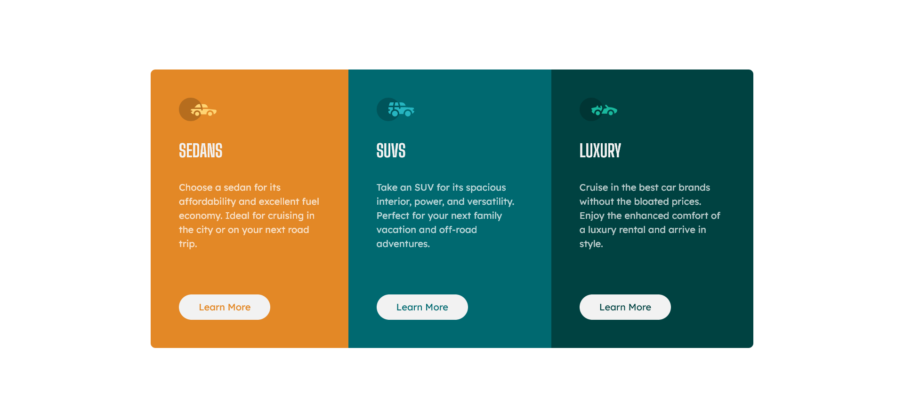

# Frontend Mentor - 3-column preview card component solution

This is a solution to the [3-column preview card component challenge on Frontend Mentor](https://www.frontendmentor.io/challenges/3column-preview-card-component-pH92eAR2-). Frontend Mentor challenges help you improve your coding skills by building realistic projects.

## Table of contents

- [Overview](#overview)
  - [The challenge](#the-challenge)
  - [Screenshot](#screenshot)
  - [Links](#links)
- [My process](#my-process)
  - [Built with](#built-with)
- [Author](#author)
- [Acknowledgments](#acknowledgments)

## Overview

### The challenge

Users should be able to:

- View the optimal layout depending on their device's screen size
- See hover states for interactive elements

### Screenshot

Desktop:

Mobile:

### Links

- Solution URL: [https://github.com/Brandon-Gui123/frontend-mentor-challenges/tree/main/With%20Tailwind%20CSS/3-column%20Preview%20Card%20Component](https://github.com/Brandon-Gui123/frontend-mentor-challenges/tree/main/With%20Tailwind%20CSS/3-column%20Preview%20Card%20Component)
- Live Site URL: [https://brandon-gui123.github.io/frontend-mentor-challenges/With%20Tailwind%20CSS/3-column%20Preview%20Card%20Component/index.html](https://brandon-gui123.github.io/frontend-mentor-challenges/With%20Tailwind%20CSS/3-column%20Preview%20Card%20Component/index.html)

## My process

### Built with

- Semantic HTML5 markup
- Flexbox
- Mobile-first workflow
- [Tailwind CSS](https://tailwindcss.com)

## Author

- Frontend Mentor - [@Brandon-Gui123](https://www.frontendmentor.io/profile/Brandon-Gui123)
- Twitter - [@Brandon_Gui123](https://twitter.com/Brandon_Gui123)
- GitHub - [Brandon-Gui123](https://github.com/Brandon-Gui123)

## Acknowledgments

Credits to this answer on StackOverflow that showed me how to hide excess parts of an element's background so that the rounded corners of its parent element can be seen. Link: [https://stackoverflow.com/a/5756518](https://stackoverflow.com/a/5756518)
