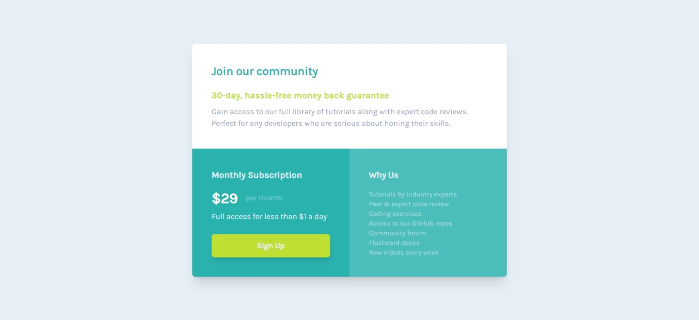

# Frontend Mentor - Single price grid component solution

This is a solution to the [Single price grid component challenge on Frontend Mentor](https://www.frontendmentor.io/challenges/single-price-grid-component-5ce41129d0ff452fec5abbbc). Frontend Mentor challenges help you improve your coding skills by building realistic projects.

## Table of contents

- [Overview](#overview)
  - [The challenge](#the-challenge)
  - [Screenshot](#screenshot)
  - [Links](#links)
- [My process](#my-process)
  - [Built with](#built-with)
- [Author](#author)

**Note: Delete this note and update the table of contents based on what sections you keep.**

## Overview

### The challenge

Users should be able to:

- View the optimal layout for the component depending on their device's screen size
- See a hover state on desktop for the Sign Up call-to-action

### Screenshot

Desktop (width of 1440px):

Mobile (width of 375px):

### Links

- [Solution](https://github.com/Brandon-Gui123/frontend-mentor-challenges/tree/main/With%20Tailwind%20CSS/Single%20Price%20Grid%20Component)
- [Live Site](https://brandon-gui123.github.io/frontend-mentor-challenges/With%20Tailwind%20CSS/Single%20Price%20Grid%20Component/index.html)

## My process

### Built with

- Semantic HTML5 markup
- Flexbox
- Mobile-first workflow
- [Tailwind CSS](https://tailwindcss.com)

## Author

- GitHub - [Brandon-Gui123](https://github.com/Brandon-Gui123)
- Frontend Mentor - [@Brandon-Gui123](https://www.frontendmentor.io/profile/Brandon-Gui123)
- Twitter - [@brandon_gui123](https://twitter.com/Brandon_Gui123)
